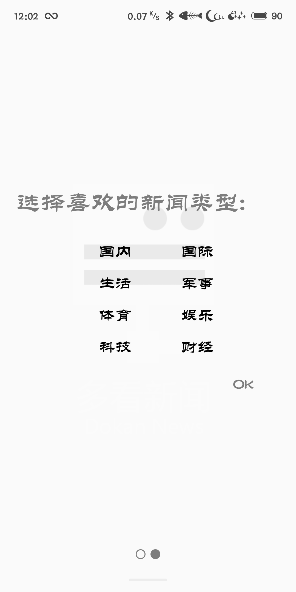
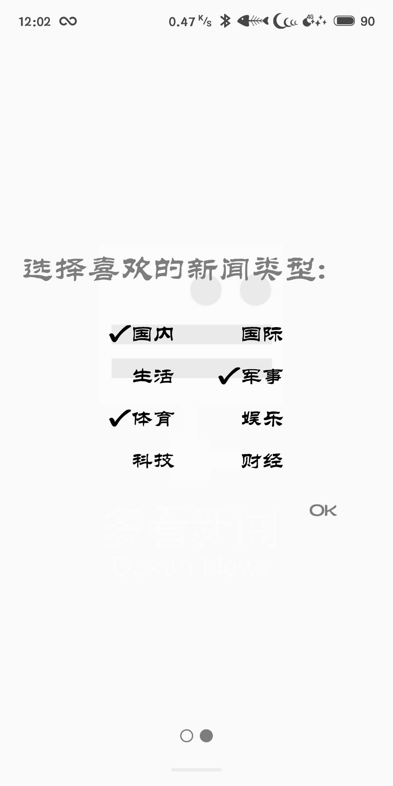

# 多看新闻用户使用手册

## 一、软件概述

### 概述

多看新闻是一款集在线浏览新闻以及收藏相关新闻为一体的、适用于各种人群的新闻APP

###功能

+ 用户登录注册，选择自己喜欢的新闻板块
+ 根据选择的喜好模块，进行新闻资讯推荐
+ 可查看新闻的概况
+ 可查看新闻的详细信息
+ 对新闻进行喜欢或不感兴趣的操作
+ 如新闻带有视频，则可以进行在线观看视频
+ 通过微信分享新闻给朋友
+ 根据用户需求自主选择设置老人模式
+ 根据用户需求自主选择设置推送模式

## 二、运行环境

直接下载安卓版apk，安装运行即可

##三、使用方法

### 用户注册

当第一次安装应用并运行时，会弹出进入的动画，并要求输入用户名字进行注册，如下图

### 用户选择喜好模块

注册之后会进入选择喜好板块的界面，根据自己的喜好多选相应的板块

### 推荐新闻列表

每次进入应用时，会根据用户最开始选择的喜好，进行新闻推荐

### 新闻的概况

点击新闻列表中的新闻，可以显示该新闻的主要内容

### 新闻的详细内容

在新闻的主要内容处点击阅读更多，可以查看新闻的详细内容

###观看视频

进入新闻的详情界面，如果有视频连接，则有相应的视频按钮，点击自动用本机浏览器进入在线新闻观看界面

### 对新闻进行收藏

如果对新闻感兴趣，可以点击心形按钮进行收藏

### 对新闻不感兴趣

点击另外的按钮，并选择不感兴趣的理由，以后可以不推荐相关的内容

### 分享新闻

自动复制新闻的链接，并打开本机上的微信

###查看收藏的新闻

在侧边栏可以打开已经收藏的新闻

### 设置老人模式

在侧边栏设置老人模式，加大字体，方便老人查看新闻

### 设置推送模式

设置推送模式，有新闻更新时会自动推送

