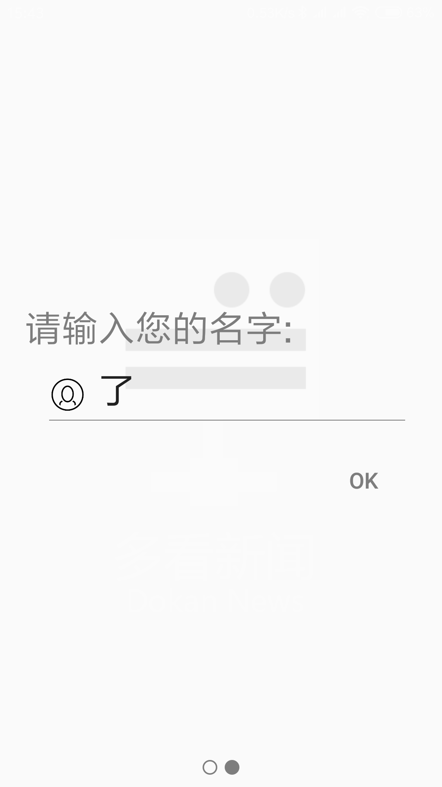
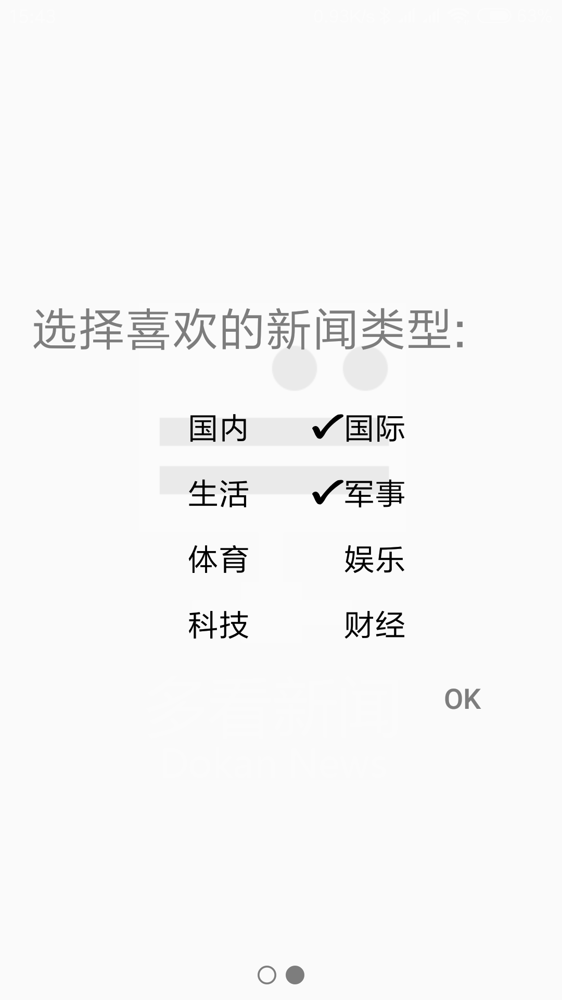
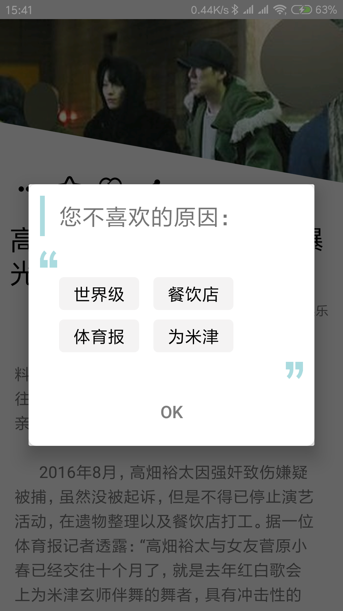

# 中山大学数据科学与计算机学院本科生实验报告
## （2018年秋季学期）
| 课程名称 | 手机平台应用开发 |   任课老师   |        郑贵锋        |
| :------: | :--------------: | :----------: | :------------------: |
|   年级   |       16级       | 专业（方向） | 软件工程数字媒体方向 |
|   学号   |     16340028     |     姓名     |        陈思航        |
|   电话   |   18664759453    |    Email     |  1466196675@qq.com   |
| 开始日期 |    20-Dec-18     |   完成日期   |      19-Jan-19       |

## 一、实验题目

期末项目——多看新闻

---


## 二、个人贡献部分

### HelloActivity欢迎页

#### Animation实现渐入渐出

这一部分比较简单，只需要通过`AlphaAnimation`进行`Layout`的透明度设置即可。通过调用`setDuration`函数设置动画持续的时间。而在`onAnimationEnd`函数实现动画结束后的操作。


#### SharedPreference的使用

在app中使用轻量级的SharedPreference实现用户登录状态的保存，如果用户第一次登录则跳转到设置引导页面中。如果不是则直接跳转到主页中。`SharedPreferences`因为需要跨Activity调用，所以不能直接使用该Activity的`SharedPreferences`而需要通过`SharedPreferences shared = PreferenceManager.getDefaultSharedPreferences(HelloActivity.this);`语句来实现`SharedPreferences`的读取。

#### 结巴分词的初始化

结巴分词的初始化需要花费大概1秒的时间，刚好跟渐入渐出的时间相近，所以在改Activity中进行结巴分词的初始化。

#### 代码

##### 结巴分词初始化

```java
JiebaSegmenter.init(getApplicationContext());
```


##### 渐变与SharedPrefernce

```java
// 渐变动画
        AlphaAnimation animAlpha = new AlphaAnimation(0,1);
        animAlpha.setFillAfter(true);
        animAlpha.setDuration(1500);
        AnimationSet set = new AnimationSet(true);
        set.addAnimation(animAlpha);
        view.startAnimation(set);

        set.setAnimationListener(new Animation.AnimationListener() {
            @Override
            public void onAnimationStart(Animation animation) {}
            @Override
            public void onAnimationRepeat(Animation animation) {}

            @Override
            public void onAnimationEnd(Animation animation) {

                SharedPreferences shared = PreferenceManager.getDefaultSharedPreferences(HelloActivity.this);
                if(shared.getBoolean("isFirst", true)){
                    //第一次进入跳转
                    Intent intent = new Intent(HelloActivity.this, FullscreenActivity.class);
                    startActivity(intent);
                    finish();
                }else{
                    Intent intent = new Intent(HelloActivity.this, MainActivity.class);
                    startActivity(intent);
                    finish();
                }
            }
        });
    }
```


### FullScreenActivity第一次使用的设置引导页

#### OnTouchListener

该Activity使用官方提供的FullscreenActivity以实现全屏显示。如果用户左滑则进入设置界面，右滑则进入应用介绍界面。使用`OnTouchListener`实现对用户滑动动作的检测。在用户抬起时进行判断，且和按下的值进行比较。如果左滑则大于20个像素需要触发跳转，右滑则需要400个像素，以防止用户在输入用户名或者勾选喜欢新闻类型的时候误触。

#### 多个Layout

同时，为了避免新建过多的Activity，于是在该Activity中设置多个Layout，分别进行用户名设置、喜欢新闻类型的选择。在这中间我还加入了“欢迎”用户的交替显示的动画。因为都是渐入渐出所以是比较简洁好看的。

##### Layout防止重叠

为了防止用户右滑后左滑再次进入设置界面的时候Layout出现重叠的情况，引入有限状态机FSM在`OnTouchListener`的触发状态进行页面状态的判断。


#### OK按钮的显示与否

在设置用户名的时候，为了使得界面更加简洁，所以我在`OnTextChanged`函数中设置确定按钮OKbutton的可见性为可见的。

<table>
<tr>
    <td>没有OK按钮</td>
    <td>含有OK按钮</td>
    <td>欢迎</td>
    </tr>
</table>

#### 新闻喜欢类型的checkbox美化

因为checkbox默认的粉红色与该引导页的简洁风不同，所以重新在阿里妈妈上寻找较为满意的勾选图标的矢量图，并通过xml文件进行是否显示勾选图标的判断。这样也就能做到用户在进行感兴趣新闻勾选的时候界面风格一致。



#### 小圆点

为了使得app介绍页与设置页能够有所区分，通过xml绘制了两个矢量圆形，并通过在`OnTouchListener`中的状态进行判断，决定选择哪一个圆点。

#### 代码

##### OnTouchListener

```java
if(event.getAction() == MotionEvent.ACTION_DOWN) {
    //当手指按下的时候
    x1 = event.getX();
}
if(event.getAction() == MotionEvent.ACTION_UP) {
    x2 = event.getX();
    if(x1 - x2 > 20) {
        if(currentImg == 0){
            ...
            // 标签页
        } else if(currentImg == 4){
            ...
            currentImg = 3;
            ...
        }
        // 防止误触发
    } else if(x2 - x1 > 400) {
        if(currentImg == 1){
           ...
            // 标签设置页
        } else if(currentImg == 3){
           ...
        }
    }
}
return true;
}
```

##### OK按钮的显示

```java
 @Override
            public void onTextChanged(CharSequence s, int start, int before, int count) {
                if(editText.getText().length() == 0){
                    findViewById(R.id.usernameOKbutton).setVisibility(View.INVISIBLE);
                }else {
                    findViewById(R.id.usernameOKbutton).setVisibility(View.VISIBLE);
                }
            }
```

##### 小圆点

```java
if(currentImg == 0){
    ImageView btn1 = findViewById(R.id.bottomBtn1);
    ImageView btn2 = findViewById(R.id.bottomBtn2);
    btn1.setImageResource(R.drawable.emptycircle);
    btn2.setImageResource(R.drawable.fullcircle);
    ...
```


### MainActivity中的侧边栏与悬浮窗中的summary获取

#### RXJava与Jsoup

为了使得在获取完summary后能够在UI上进行更新，所以使用了观察者模式RXJava，并通过Jsoup进行网络访问（利用json类中的url），并进行html的解析，通过筛选其中所有类型p的标签，得到其中的内容，对其进行求并集后选取其前60个字符（60个字符的长度刚好而且开启老人模式后不会填满屏幕），在观察者中通过回调UI线程进行TextView的字符串设置。注意，如果无法获取字符串则需要进行对应的提示。


#### 代码

```java
Observable.create(new ObservableOnSubscribe<Feed>() {
@Override
public void subscribe(ObservableEmitter<Feed> emitter) throws IOException {
    Integer sum = feedList.size();
    // 对于获得的列表进行处理
    Log.i("got news number", sum.toString());
    for(Feed e : feedList){
    Log.i("got news", e.getTitle());
    Document doc = Jsoup.connect(e.getLink()).get();
    Log.i("html", doc.title());
    Element body = doc.body();
    Elements p = body.select("p");
    e.setSummary("");
    String currentSummary = "";
    for(Element element : p){
        currentSummary += element.text();
    }
    if(currentSummary.length() > 60){
        currentSummary = currentSummary.substring(0, 60);
        currentSummary += "...";
    }
    e.setSummary(currentSummary);
    Log.i("Jsoup", e.getSummary());
    if(e.getSummary().length() == 0){
        e.setSummary("找不到对应文本哦/./");
    }
    emitter.onNext(e);
}
emitter.onComplete();
ld.dismiss();
mRefreshLayout.finishRefresh();
            }
            // 需要回调主线程
        }).subscribeOn(Schedulers.computation())
.observeOn(AndroidSchedulers.mainThread())
.subscribe(new Observer<Feed>() {

    @Override
    public void onSubscribe(Disposable d) {

    }

    @Override
    public void onNext(final Feed value) {
        myAdapter.addItem(value);
        Log.d("尝试一下",value.toString());
        myAdapter.notifyDataSetChanged();
    }

    @Override
    public void onError(Throwable e) {
        Log.d(TAG, "Error exist");
    }

    @Override
    public void onComplete() {
        Log.d(TAG, "Complete Sending Paragraph");
        setViewPager();
        findViewById(R.id.drawer_layout).setVisibility(View.VISIBLE);
    }
});
```

### NewsActivity详情页

这一部分比较复杂，分为UI与功能两个部分来讲。

#### UI

UI的设计与前面的设置引导页类似，追求简洁，所以对于MainActivity传入的新闻url，依然通过观察者模式RXJava与Jsoup进行内容的解析，并选其中的一张图片进行顶部图片的显示。顶部图片为梯形，左下部可以放置按钮。如果新闻含有视频则出现视频跳转的按钮，否则只出现隐藏的按钮。点开后出现收藏、不喜欢、分享按钮。

<table>
<tr>
    <td>没有OK按钮</td>
    <td>含有OK按钮</td>
    </tr>
</table>

##### 收藏按钮

收藏按钮点击后会对数据库进行操作，如果数据库已经有这则新闻，则进行提示，否则将该新闻的主要属性存入数据库中（数据库不是我做的）。为了使得界面更加好看，这里通过`GoodView`框架与渐入渐出的动画，添加点击时对应描述升起来的动画效果。

##### 不喜欢按钮

该按钮与收藏按钮的动画类似，但是在点击之后会跳出一个对话框，其中包含有4个（也可以小于4个）该文章出现频数最高的关键词（在之前需要进行筛选）。对话框Dialog是自定义的，于是我新建CommonDialog类，该类用于对对话框的功能进行扩展，具体下面有讲到。注意，如果无法获取该文章的分词，弹出吐司。

##### 视频跳转按钮

进行html进行解析的时候，判断是否有两种与网页中视频有关的class的标签，如果有则该新闻存在有视频。将视频跳转按钮的Visibility设置为`Visible`。之后依旧通过`GoodView`框架与渐入渐出实现点击的效果。在点击后根据该新闻的url，通过Intent将转换为uri的url传给浏览器，从而实现跳转。需要注意在catch时添加吐司提示用户没有进行浏览器的跳转。

##### 分享按钮

这个按钮在点击后复制url到剪贴板并跳转到微信，如果不能正常跳转会有所提示（弹出吐司）。这里需要用到`ClipboardManager`类的实例以实现剪贴板的复制。动画同上。

#### 顶部图像滑动隐藏

使用`OnTouchListener`对用户的滑动动作进行y轴方向检测。对`ScrollView`设置滑动监听器，并通过其高度判断滑动是否到达`ScrollView`的顶部，从而判断是否需要显示上面的图片。图像透明度与顶部距离的比例进行绑定，越接近顶部图像透明度越低直到0。


##### 增大阻尼

为了避免惯性带来的对ScrollView滑动距离产生的影响，新建一个继承`ScrollView`的类，并对其阻尼进行设置。在该app中设置阻尼为原阻尼的1/9，即在类`SlowScrollView`并Override其`fling`函数从而获得更大的阻尼。

#### 信息获取与解析

##### 解析

在获取新闻内容后，通过Jsoup进行html的解析。找出所有的类型为`p`的标签。这些标签可能出现有“图为…”的字样。如果符合现则需要进行删除。还需要对文本进行分段操作，即每次获取`p`类型的标签后，加上两个`\n`实现换行。

对于含有`手机新浪网`或者是`新浪视频`的标题，需要进行删除。


##### 词频分析

为了避免UI线程的阻塞，多开线程进行这项操作。对于结巴分词框架，输入句子，结巴分词框架可以将其分解为词的集合。

对于给定的集合，还需要进行初步筛选，即对于这个集合中的元素，通过DetectWords类筛选掉字母、数字、汉字数字、连词、形容词以及代词，且只保留长度大于3的名词。之后对所有的关键词进行遍历，并进行词频统计。按词频从大到小进行排序。对于最大4个作为该新闻的关键词。关键词可以由用户进行不喜欢原因的筛选以及MainActivity获取新闻后的筛选，以提升用户的体验。对于获得的键值对，保存到数据库中的分词表中，以实现永久化存储。


#### 内容获取

#### 代码

##### UI设计中顶部梯形图片实现（通过约束布局）

```xml
 <ImageView
        android:id="@+id/newsImage"
        android:layout_width="match_parent"
        android:layout_height="wrap_content"
        android:scaleType="centerCrop"
        android:adjustViewBounds="true"
        android:src="@drawable/dokan_logo"/>
    <ImageView android:layout_height="match_parent"
        android:layout_marginTop="25dp"
        android:layout_width="match_parent"
        android:src="@drawable/rotate"/>
```

##### 主要按钮的实现

###### 分享（视频类似）

```java
final View tv = v;
ClipboardManager myClipboard;
myClipboard = (ClipboardManager)getSystemService(CLIPBOARD_SERVICE);
ClipData myClip;
myClip = ClipData.newPlainText("text", url);
myClipboard.setPrimaryClip(myClip);
goodView.setText("链接已复制");
goodView.show(v);
tv.setAlpha(1);
    // 跳转微信
    try {
        Intent intent = new Intent(Intent.ACTION_MAIN);
        ComponentName cmp = new ComponentName("com.tencent.mm","com.tencent.mm.ui.LauncherUI");
        intent.addCategory(Intent.CATEGORY_LAUNCHER);
        intent.addFlags(Intent.FLAG_ACTIVITY_NEW_TASK);
        intent.setComponent(cmp);
        startActivity(intent);
        } catch (ActivityNotFoundException e) {
        // TODO: handle exception
        Toast toast = Toast.makeText(NewsDetail.this, "没有安装微信，不进行跳转",Toast.LENGTH_LONG);
        toast.show();
        }
```

###### 不喜欢按钮

```java
tv.setAlpha(1);
if(isWordNull){
    Toast.makeText(NewsDetail.this, "抱歉，无法获得该文章的分词!", Toast.LENGTH_SHORT).show();
}else{
    commonDialog.getMessage(favWords);
    commonDialog.show();
}
```

###### 内容解析

```java
// 进行文字解析
Elements p = body.select("p");

StringBuilder buf = new StringBuilder();
for(Element e : p) {
    String s = "      ";
    s += e.text();
    if(s.indexOf('\n') == -1) {
        s += '\n';
        s += '\n';
    }
    // 去除干扰
    if(s.indexOf("图为") != -1) continue;
    buf.append(s);
}
res.setText(buf.toString());
Log.d(TAG, "subscribe: " + res.getText());
```

###### 词频分析

```java
// 多线程分词
new Thread(){
    // 排序
    class SortByFrequency implements Comparator {
        public int compare(Object o1, Object o2) {
            WordFrequency s1 = (WordFrequency) o1;
            WordFrequency s2 = (WordFrequency) o2;
            if (s1.getFrequency() < s2.getFrequency())
                return 1;
            else if(s1.getFrequency() == s2.getFrequency()) return 0;
            return -1;
        }
    }

    @Override
    public void run(){
        ArrayList<WordFrequency> local_str_val = new ArrayList<>();
        ArrayList<String> wordList = JiebaSegmenter.getJiebaSegmenterSingleton().getDividedString(analizedString);
        for(String str : wordList){
            if(str.length() <= 2) continue;
            // 筛选
            if(!DetectWords.inValid(str)) continue;
            boolean flag = false;
            for(WordFrequency e : local_str_val){
                if(e.getWord().equals(str)){
                    local_str_val.get(local_str_val.indexOf(e)).add();
                    flag = true;
                    break;
                }
            }
            if(!flag){
                WordFrequency tmp = new WordFrequency(str, 1);
                local_str_val.add(tmp);
            }
        }
        if(local_str_val.size() == 0) {
            isWordNull = true;
            return;
        }
        // 排序
        Collections.sort(local_str_val, new SortByFrequency());
        for(int i = 0; i < local_str_val.size() && i < 4; i++){
            WordFrequency e = local_str_val.get(i);
            favWords.add(e.getWord());
            Log.d("analyze", e.getWord() + " " + e.getFrequency().toString());
            // todo:永久化保存数据。如果存在数据则加上对应的val值，如果没有则进行保存。=> done

            WordFrequency wf = new WordFrequency(e.getWord(), e.getFrequency());
            if(mDatasource.getFrequency(e.getWord()) == null) {
                Log.d(TAG, "run: insert new word into word_frequency table: " + e.getWord());
                mDatasource.insertNewWord(e.getWord());
            }
            mDatasource.updateFrequency(wf);
            Log.d(TAG, "run: frequency related word:" + e.getWord() +"frequency:" + mDatasource.getFrequency(e.getWord()));
        }
    }
}.start();
```

### 网络访问（不包括异常处理）

这一部分是我设计的，具体过程也比较复杂，结构文档表述我写的比较清楚，所以我直接拿结构文档的那一部分过来了。

对于MainActivity中的内容，需要从MainActivityNetwork类中获取。这个类负责进行网络访问以及新闻的缓存。

- 首先对于之前第一次打开的欢迎页时候选择的新闻类型，设置对应的url。
- 之后每次进行网络访问的时候，根据之前选择的url中随机选取两个类型的url，再加上推荐新闻的url，一个三个url进行网络访问。注意，网络访问需要多开一个线程以免阻塞UI线程。

- 对于随机选取的3个url，通过`OkHttpClient`进行网络访问，并通过call back进行异步的调用。对于返回的json字符串，通过Gson进行json的解析。之后对于获取的新闻实例，进行遍历，并进行分词的筛选，根据之前的分词键值对查找符合的新闻（含有用户点击的新闻中出现频数最高的分词）。然而，筛选的结果不能查过3个因为如果都是用户之前点击的新闻则可能出现用户无法观看其他新闻的情况。所以需要预留2个是其他的新闻，并从中随机筛选。
- 在进行网络访问后，对之前所有用户感兴趣的类型以及推荐新闻，多开一个线程进行缓存，以避免每次刷新进行网络访问提升app的性能。
- 在进行刷新的时候，调用getNesAgain()函数，该函数会清空之前的List并从缓存中获取新闻（如果之前缓存为空则在第一次进行访问后的新闻中挑选）。对于第一则置顶的新闻进行分词筛选，剩下的随机筛选，因为一段时间内能够获取的新闻数量是一定的，所以如果太多使用分词筛选的新闻可能会使得用户只能得到相关话题，所以只有第一条新闻是分词筛选的，剩下的是随机推送的。在刷新次数等于5的时候，清空缓存，重新获取新闻，以避免用户观看完缓存中的所有新闻。
- 获取的过程如下：

```java
new Thread(new Runnable() {
@Override
public void run() {
    try{
        sleep(15000);
    }catch (InterruptedException e){
        e.printStackTrace();
    }
    if(!isFinish){
        HandlerManager.getInstance().sendFailMessage();
    }
}
                }).start();
                final ArrayList<String> tmpUrls = new ArrayList<>();
                if(setOfUrls.size() > 2){
// 从里面随机获取1类
Integer r1 = (int)(Math.random() * setOfUrls.size());
Integer r2 = (int)(Math.random() * setOfUrls.size());
while(r2 == r1){
    r2 = (int)(Math.random() * setOfUrls.size());
}
Log.i("select type",r1.toString() + " " + r2.toString());
tmpUrls.add(setOfUrls.get(r1));
tmpUrls.add(setOfUrls.get(r2));
                } else {
for (String u : setOfUrls){
    tmpUrls.add(u);
}
                }


                for(String url : tmpUrls){
OkHttpClient okHttpClient = new OkHttpClient();
final Request request = new Request.Builder()
        .url(url)
        .get()//默认就是GET请求，可以不写
        .build();
Call call = okHttpClient.newCall(request);
call.enqueue(new Callback() {
    @Override
    public void onFailure(Call call, IOException e) {
        Log.e("OKHTTP", "No Internet");
        HandlerManager.getInstance().sendFailMessage();
        return;
    }
    @Override
    public void onResponse(Call call, Response response) throws IOException {
        Log.i("onresponse","getREsult");
        if (response.isSuccessful()) {
            Gson gson = new Gson();//创建Gson对象
            JsonRootBean bean = gson.fromJson(response.body().string(), JsonRootBean.class);//解析
            resultLock.lock();
            int pos;
            if(list1.isEmpty()) {
                list1 = bean.getData().getFeed();
                pos = 1;
            }
            else {
                pos = 2;
                list2 = bean.getData().getFeed();
            }
            // todo:分词处理
            // 不能太多相关新闻
            if(feedList.size() < 1){
            ...
            }
            if(result < tmpUrls.size() - 1){
                result ++;
            } else{
                //不够则随机选择
               ...
            }
            resultLock.unlock();
        }
    }
});
                }
            }
        }).start();
```

- 刷新的过程如下：

```java
// 刷新数据
    public void getNewsAgain(){
        tmpp.clear();
       new Thread(new Runnable() {
           @Override
           public void run() {
               feedList.clear();
               // 获取本地数据
               if(finishAll){
                   getFromExistedList(bigList);
               }else{
                   List<Feed> ls = new ArrayList<>();
                   ls.addAll(list1);
                   ls.addAll(list2);
                   getFromExistedList(ls);
               }

               if(feedList.size() > 5){
                   tmpp.addAll(feedList);
                   feedList.clear();
                   for(int i = 0; i < 5; i++){
                       feedList.add(tmpp.get(i));
                   }
               }
               for(Feed e : feedList){
                   Log.i("sss", e.getTitle());
               }
               HandlerManager.getInstance().sendSuccessMessage();
               if(refreshCount >= 5){
                   bigList.clear();
                   finishAll = false;
                   bigListNum = 0;
                   refreshCount = 0;
                   getMost();
               } else{
                   refreshCount++;
               }
           }
       }).start();
    }
```

- 因为MainActivity在获取第一次成功获取新闻后才能进行列表的刷新，所以需要添加一个类进行Message的传递，以实现MainActivity与MainActivityNetworkVisit类的沟通。具体实现如下：

  - 在MainActivity中创建Handler。
  - 在HandlerManager类中，创建单实例。并将MainActivity类的Handler传入。之后如果网络发送成功则MainActivity调用HandlerManager类中的函数`sendSuccessMessage`，该函数向Handler传送数字200，如果失败调用`sendFailMessage`，该函数传送数字404。对于MainActivity，只需要对状态码进行判断，即可判断网络异常与否。如果发送成功则对获得的数据进行处理。
  - 与TCP协议中的计时器类似，这里需要设定一个计时器，如果计时器超时，发送`FailMessage`到MainActivity，由MainActivity进行网络异常的处理。

  ```java
  public void setHandler(Handler handler) {
          this.mHandler = handler;
      }
  
      public void sendSuccessMessage() {
          mHandler.sendEmptyMessage(200);
      }
  
      public void sendFailMessage() {
          mHandler.sendEmptyMessage(404);
      }
  ```

  - 计时器如下：

  ```java
  new Thread(new Runnable() {
  @Override
  public void run() {
      try{
          sleep(15000);
      }catch (InterruptedException e){
          e.printStackTrace();
      }
      if(!isFinish){
          HandlerManager.getInstance().sendFailMessage();
      }
  }
  }).start();
  ```

### LoadingDialog、UserDialog

#### LoadingDialog

加载框由两个部分组成，一个是上面的gif动画，通过`pl.droidsonroids.gif.GifImageView`框架进行gif图片的显示。下面则新建一个Thread，通过sleep一段时间控制下面'信息比对中…'的循环播放。在MainActivity或者NewsdetailActivity中通过RXJava中的`Oncomplete`函数调用dialog类的`dimiss`函数实现对话框的消失。

#### UserDialog与用户名修改

如果用户点击MainActivity中侧边栏用户名旁边的编辑按钮，可以在弹出来的对话框里面对用户名进行修改。这时，需要用`SharedPreference`的读取与操作，同时也需要用到自定义的Dialog。通过在MainActivity中创建接口与回调函数并传进去到Dialog的类中，实现`SharedPreference`的访问。对于该接口中的函数定义，在MainActivity中完成即可。

#### 代码

##### LoadingDialog

```java
new Thread(){
            @Override
            public void run(){
                while(flag){
                    try{
                        Thread.sleep(50);
                    }catch (InterruptedException e){
                        e.printStackTrace();
                    }
                    handler.post(new Runnable() {
                        @Override
                        public void run() {
                            if(tv.getText().equals("信息比对中...")){
                                tv.setText("信息比对中.");
                            } else if(tv.getText().equals("信息比对中.")){
                                tv.setText("信息比对中..");
                            } else{
                                tv.setText("信息比对中...");
                            }
                        }
                    });
                }
            }
        }.start();
```

##### UserDialog

###### Dialog部分

```java
super.onCreate(savedInstanceState);
        setContentView(R.layout.usernamedialog);
        setCanceledOnTouchOutside(false);
        Button okbutton = findViewById(R.id.userOkButton);
        okbutton.setOnClickListener(new View.OnClickListener() {
            @Override
            public void onClick(View v) {
                TextView tv = findViewById(R.id.usernameAgain);
                callback.edit(tv.getText().toString());
                dismiss();
            }
        });
```

###### 回调函数

```java
UserDialog ud = new UserDialog(MainActivity.this, new editView() {
@Override
public void edit(String str) {
    final NavigationView navigationView = findViewById(R.id.nav_view);
    //获取NavigationView上的组件
    View v = navigationView.getHeaderView(0);
    TextView tvu = v.findViewById(R.id.gotUsername);
    tvu.setText(str);
    // 缓存用户名
    SharedPreferences shared = PreferenceManager.getDefaultSharedPreferences(MainActivity.this);
    SharedPreferences.Editor editor=shared.edit();
    //第一次进入跳转
    editor.putString("user", tvu.getText().toString());
    Log.i("set username", tvu.getText().toString());
    editor.commit();
}
});
```

### 需求分析设计

在期末项目中，协助团队成员进行需求的分析设计，想出一套推送-详情分词与反馈-再次推送时进行筛选与随机筛选结合的设计思路。这也是这个app的核心思想。同时，这个app应该是轻量化的，没有冗余的功能，也不应该有精确推送的广告。所以主页只有5条新闻，这也是因为5条新闻刚好覆盖手机屏幕，每次下拉刷新可以获得新的新闻（当然为了性能引入缓存机制）。总之，它是随着用户的使用逐渐贴近用户的喜好，并且根据用户反馈进行新闻筛选机制更新的app。

## 遇到的问题以及解决方案

### UI设计

#### FullscreenActivity

- 对于用户输入用户名的`EditText`组件，需要限制行数、最大的字符数量以及禁止换行，否则用户按下回车后换行，之前输入的内容看不到了。
- app介绍的图片太大，无法正常显示。所以需要对图片进行压缩操作。
- 需要在`OnTouchListener`中设置左滑的阈值小于右滑阈值，以避免用户在点击或者输入用户名的时候右滑进入app介绍页。
- 欢迎词的交替动画无法正常显示，需要在`onAnimationEnd`函数中添加一些设置以及通过设置延时开始动画解决这个问题。
- 因为不同的Activity使用同一个SharedPreference，而模式为Private，所以需要设置如`SharedPreferences shared = PreferenceManager.getDefaultSharedPreferences(MainActivity.this);`从而实现SharedPrefernce的正常使用。

#### MainActivity

- 通过Jsoup进行html解析的时候可以对标签的类型以及类class同时进行筛选，避免无关信息的混入悬浮窗口的summary。

#### DetailActivity

- 实现顶部图片显示的时候，因为遮挡的图形恰好使得上面的图片形状为梯形，而在横屏的时候无法正常遮挡，所以应该锁定屏幕方向为竖直的。
- ImageView作为按钮使用的时候，应该设定一定的padding大小，避免因为图片太小用户无法正常点击的情况。
- 对于顶部图片的滑动隐藏，为了避免惯性带来的影响，应该对ScrollView的阻尼进行设定。所以要新建一个继承ScrollView的类，并对其阻尼大小进行调节。
- 为了判断是否含有视频，应该对标签的类class进行筛选，因为标签的类型为a，而不是video。所以如果只对类型而不对类进行筛选无法得到视频对应的标签。

### 功能实现

- RXJava应该与Retrofit或者Jsoup搭配使用，与OKHTTP搭配使用原生的Call效率低下且丧失其原有目的。最后通过RXJava与Jsoup的搭配实现网络访问。
- 在进行分词统计的时候需要新建一个线程，特别是刷新的时候，直接在UI线程中进行操作导致反应迟钝或者无响应。
- 因为对所有api的URL进行网络访问抓取所有新闻需要一定的时间，这段时间内如果用户刷新，需要使用原来获取的新闻作为临时缓存，否则会导致崩溃。
- 因为是多个url进行异步网络访问的操作，所以需要加上线程锁以避免脏写或者脏读。
- 如果刷新列表时进行重新获取的阈值太大，导致用户看到太多相同新闻，如果太小导致性能低下，因为在刷新的时候需要进行网络访问。
- 不能有太多根据用户点击新闻产生的分词进行筛选的新闻，这样做会导致最后只会有一个主题的新闻。
- 在进行词频统计的时候，需要注意去除代词、形容词、连词、字母、数字以及限制名词的最小长度，否则出来的是常用词不能作为该新闻的关键词。
- 为了实现网络正常和异常的处理，通过中介类`HandlerManager`实现不同类，特别是Activity与内容获取类中线程的沟通，否则无法实现不同类中UI线程与其他线程的沟通。（其实回调函数也可以，在修改用户名的时候直接传入回调函数，也是非常方便的。）


## 个人总结与贡献评分

这次期末项目，个人负责详情页、引导页、欢迎页、Dilalog（不包括选择用户不喜欢分词的Dialog以及网络异常提示的Dialog）的UI设计、内容的获取与缓存（不包括数据库）和词频分析、反馈、筛选的部分。因为期末项目的功能数量较多而且联系也比较紧密，其中一部分如果出现差错则可能导致其他功能无法正常使用，而且其中的一些功能也比较耗时（特别是分词）,只能多开线程进行操作，以避免阻塞UI线程（在刷新的时候出现动画卡顿问题）。

不仅如此，为了提高程序的性能，引入新闻缓存的机制，此时在什么时候再次进行新闻获取、获取那些新闻也就是一个问题，因为如果在刷新的时候获取，效率很低，所以需要新开线程在第一次获取之后再次进行获取，而且在刷新5次之后再次获取。对于多个url的网络访问，因为是异步的，所以要加上线程锁，否则脏写的情况会导致无线循环（当然这种情况是偶尔出现）。这个时候，加锁的时机也得仔细斟酌，因为加锁的位置影响性能表现。

而对于一开始的app运作方式的构思，核心思想是推送-详情分词与反馈-再次推送时进行筛选与随机筛选结合，再加上数据库的支持实现较为完整的app。对于其他的功能，都是在这个基础上根据实际情况加上的，比如用户名、是否进行视频跳转、加载动画等，都是为了完善app的视觉设计以及用户体验。在完成这个app的过程中，也在不断更改之前的代码（比如新闻的获取，一开始只使用推荐新闻的api，之后为了多个url进行网络访问，将其独立成为一个类，又要考虑不同实例，特别是Activity与其他类之间的通信问题）。

不可否认个人协助团队在这次期末项目中的贡献也是比较大的。

## 思想感悟

这次期末项目是对之前学习知识的检验，特别是后半学期所学的网络访问以及相关设计模式知识的考验。为了使得app的功能更加完善，界面更加美观，也必须使用其他一些框架，比如`GoodView`、`结巴分词`等。不同的功能结合在一起又要避免出现问题，同时也更要考虑程序的性能（充分利用不同线程执行程序），所以整个过程也是比较辛苦的。

但是，也正是这个期末项目，能够使我一来充分利用之前知识真正完成一个可用的app，二来提高自己的团队协作能力。因为多人协作即使分工良好依然可能出现代码的冲突，所以要讨论确认各个部分的功能之后删除冗余代码或者进行更新。

总之，这个期末项目感触颇深，因为我为这个期末项目付出特别多的努力。这是因为它时间是比较紧的，在期末考前匆忙上马的前一版本代码完成度极低，漏洞极多，所以我也只能推倒重来，充分利用时间进行重新构思和实现相关功能的代码。