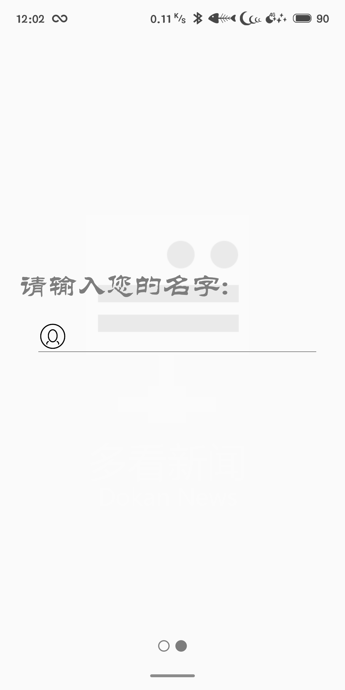
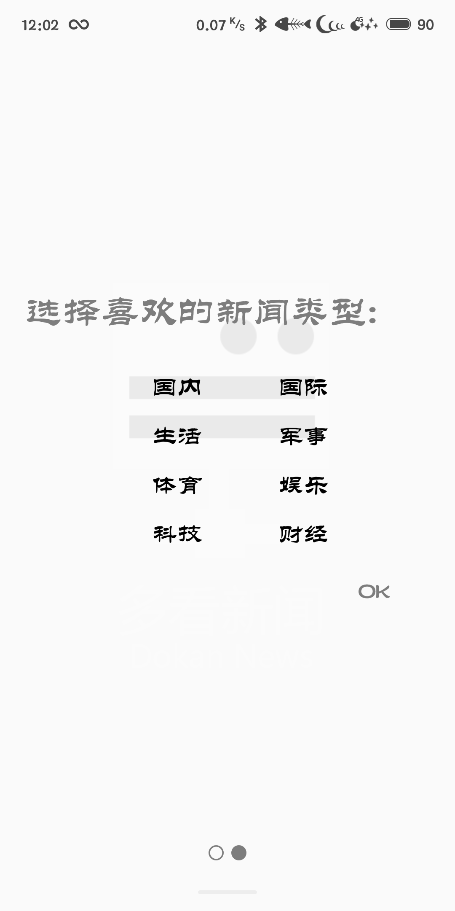
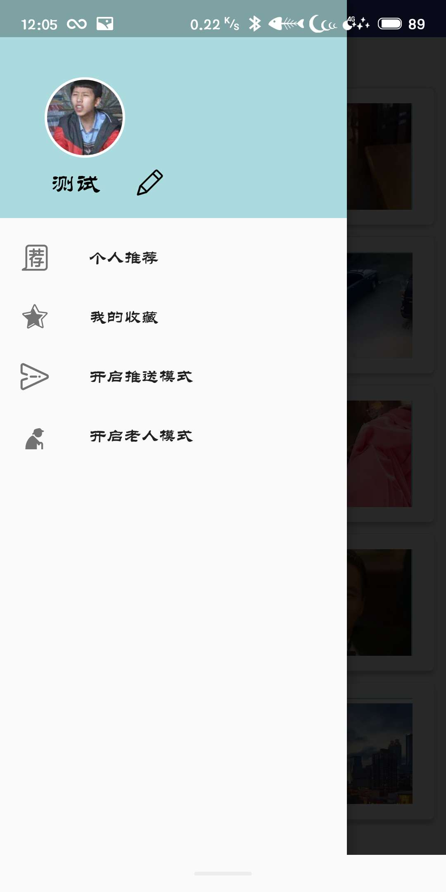
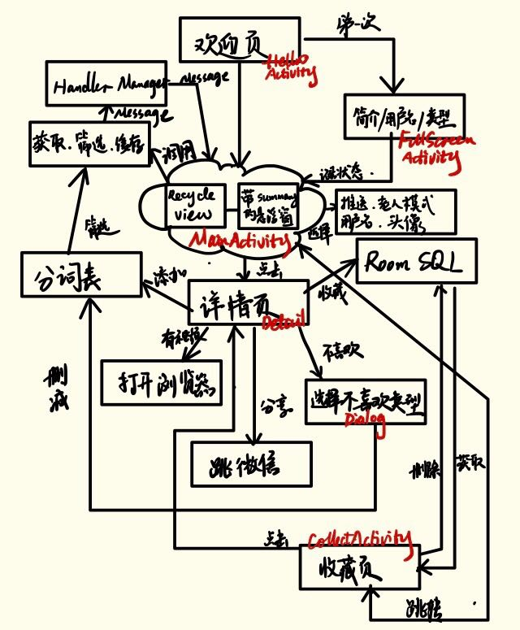
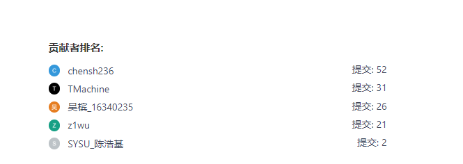

# 小组报告

|   类别   |             内容             |
| :------: | :--------------------------: |
|  应用名  |           多看新闻           |
| 应用类别 |          新闻类APP           |
|   组员   | 陈思航、吴梓溢、陈统盼、吴槟 |
|          |                              |


## 程序运行界面截图

+ 开始注册的界面

  

+ 选择喜好新闻板块

  

+ 推荐新闻列表

  

+ 新闻概况小卡片

  

+ 新闻详情页

  

+ 侧边栏

  

+ 收藏列表

  

## 应用类图

+ 用户个人中心

  

+ 新闻功能

  

+ 应用流程图

  

## 所采用的技术和采用该技术的原因

# 采用的技术

### 欢迎页面

#### 应用打开的欢迎页面（HelloActivity）

- 使用AlphaAnimation实现应用欢迎页图片的淡入。通过调用`setDuration`函数设置动画持续的时间。在实验中持续时间为1500ms。通过`onAnimationEnd`函数实现动画结束后的操作。
- 使用`SharedPreferences`这一轻量级的存储类保存用户使用应用的状态，即是否第一次打开该应用，如果是则跳转到首次打开应用的欢迎界面，否则直接跳转到主页。注意该程序中所有用到的`SharedPreferences`因为需要跨Activity调用，所以不能直接使用该Activity的`SharedPreferences`而需要通过`SharedPreferences shared = PreferenceManager.getDefaultSharedPreferences(HelloActivity.this);`语句来实现`SharedPreferences`的读取。
- 通过Override函数`onBackPressed`使其置空，从而使返回按钮失效，避免出现异常。

#### 首次打开应用的欢迎页面(FullscreenActivity)

- 这个页面使用官方提供的FullscreenActivity以实现全屏显示。
- 在这个页面中使用`OnTouchListener`实现对用户滑动动作的检测。在实验中只对x轴方向的滑动进行检测。如果用户左滑则进入设置界面，右滑则进入应用介绍界面。需要注意这里左滑和右滑的实现过程中，在用户抬起时进行判断，且和按下的值进行比较。如果左滑则大于20个像素需要触发跳转，右滑则需要400个像素，以防止误触。
- 在这个Activity中其实有多个`ConstrantLayout`，通过设置其可见性`Visibility`从而实现在单个Activity中有多个界面的功能。因为跳转Activity时整个页面发生变化，而通过不同的Layout在同一个Activity中可以实现只通过淡入淡出实现界面的变化。在实现过程中，还需要对不同Layout的状态进行判断，以防止用户左滑后右滑返回Layout上的信息重叠。

```java
if(event.getAction() == MotionEvent.ACTION_DOWN) {
                    //当手指按下的时候
                    x1 = event.getX();
                }
                if(event.getAction() == MotionEvent.ACTION_UP) {
                    x2 = event.getX();
                    if(x1 - x2 > 20) {
                        if(currentImg == 0){
                            ...
                            // 标签页
                        } else if(currentImg == 4){
                            ...
                            currentImg = 3;
                            ...
                        }
                        // 防止误触发
                    } else if(x2 - x1 > 400) {
                        if(currentImg == 1){
                           ...
                            // 标签设置页
                        } else if(currentImg == 3){
                           ...
                        }
                    }
                }
                return true;
            }
```

- 通过`onTextChanged`函数检测用户是否输入了用户名。如果输入了则显示OK按钮。
- 依旧使用`SharedPreferences`来缓存用户名以及用户喜欢的新闻类型。新闻类型之间使用'&'进行分割。同时需要修改第一次访问的记录。实现过程与上面所述的类似。
- 要实现淡入淡出的组件切换，需要在淡出动画的`onAnimationEnd`中调用新的淡入动画，或者通过`setStartOffset`实现动画的延时开始。

### 详情页（NewsDetail）

- 顶部图像的设置
  - 为了实现顶部的梯形图像，需要有一张源图像（使用ImageView）和一个平行四边形（旋转了的矢量矩形，也是ImageView）进行遮挡。平行四边形使用的颜色与背景色相同。在实际实现过程中，需要禁用屏幕旋转以获得比较好的效果。同时，为了解决图片的变形问题，需要对图片的大小进行限制，维持画面纵横比4:3的比例，过程如下：

```java
// 设置主图比例
        WindowManager wm = (WindowManager) getBaseContext()
                .getSystemService(Context.WINDOW_SERVICE);
        DisplayMetrics outMetrics = new DisplayMetrics();
        wm.getDefaultDisplay().getMetrics(outMetrics);

        int screenWidth = outMetrics.widthPixels;
        imgview.setMaxWidth(screenWidth);
        imgview.setMaxHeight(screenWidth);
```

- 顶部图像的隐藏实现
  - 为了实现顶部图像的隐藏，依然需要使用`OnTouchListener`对用户的滑动动作进行检测。这次检测的是y轴方向的动作。通过对`ScrollView`设置滑动监听器，并通过其高度判断滑动是否到达`ScrollView`的顶部，从而判断是否需要显示上面的图片。在实际过程中，需要设定的不是是否到达顶部而是比例，根据滑动到达顶部的距离对上面的图片设置正确的透明度从而实现淡入淡出的效果。

```java
int scrollY=view.getScrollY();
                int height=view.getHeight();
                int scrollViewMeasuredHeight=scrl.getChildAt(0).getMeasuredHeight();
                if(scrollY - scrollViewMeasuredHeight < 100){
                    float alpha = scrollY / (float)100.0;
                    if(alpha > (float)1.0) alpha = (float)0.0;
                    else alpha = (float)1.0 - alpha;
                    if(alpha < 0.1) alpha = 0;
                    if(alpha < 0.5) buttonset.setVisibility(View.GONE);
                    else buttonset.setVisibility(View.VISIBLE);
                    imgview.setAlpha(alpha);
                }
                return false;
```

- 滑动阻尼的设置
  - 需要进行`ScrollView`的设置因为如果滑动阻尼过小会导致较大的惯性。也就是到达顶部后反弹，从而导致用户滑动到达顶部后依然不显示图片的情况，因此需要对`ScrollView`的滑动阻尼进行设置。在实验过程中，需要新建新的类`SlowScrollView`并Override其`fling`函数从而获得更大的阻尼。语句如下：`super.fling(velocityy / 9);`。
- 不喜欢类型的Dialog
  - 这个Dialog需要新建新的类，称为`CommonDialog`。这个Dialog中共有四个`checkbox`，对应内容中所选择的4个频次最高的分词。当然，如果只有3个则对应的checkbox的`Visibility`设为`Gone`。
  - 在用户点击OK按钮后，会对数据库中分词的键值对中对应的分词进行删除。因为在数据库中分词-频数的键值对值是从大到小排序的，所以删除后以后刷新（注意不是下次，因为设置了缓存，没刷新5次才真正重新获取内容）出现的概率降低。同时需要注意`setCanceledOnTouchOutside(false);`使得用户不可以点击对话框外的内容。
- 加载框的实现
  - 加载框需要进行循环显示动画。所以需要新建一个Thread，通过sleep控制下面'信息比对中…'这几个字的循环播放，而对上面的动图，它是gif格式，所以需要通过`pl.droidsonroids.gif.GifImageView`框架进行gif图片的显示。在MainActivity或者NewsdetailActivity中通过RXJava中的`Oncomplete`函数调用dialog类的`dimiss`函数实现对话框的消失。同时需要注意用户不可以点击对话框外的内容，设置过程同上。
- 网络状态处理
  - 通过`ConnectivityManager`类进行网络连接的判断，如果网络异常则弹出对话框。对话框。在用户点击OK按钮的时候执行`finish`函数结束该Activity。

```java
// 判断网络状态-------
        ConnectivityManager connectivityManager = (ConnectivityManager) this.getApplicationContext().getSystemService(Context.CONNECTIVITY_SERVICE);
        NetworkInfo info = connectivityManager.getActiveNetworkInfo();
        if(info == null || !info.isConnected()) {
            final Dialog dialog = new Dialog(this);
            View contentView = LayoutInflater.from(this).inflate(
                    R.layout.dialog_recommend, null);
            dialog.setContentView(contentView);
            dialog.setCanceledOnTouchOutside(true);
            Button OK = contentView.findViewById(R.id.OkButton);
            OK.setOnClickListener(new View.OnClickListener() {
                @Override
                public void onClick(View view) {
                    dialog.dismiss();
                    finish();
                }
            });
            dialog.show();
        }
```

- 更改字体大小
  - 根据bundle传进来的字体大小进行设置，以适应前面实现的老人模式。

```java
//调整字体大小
        mTextSize = bundle.getFloat("size");
        oldManModel = bundle.getBoolean("oldManModel");
        TextView tv1 = findViewById(R.id.paragraph);


        //改变字体大小
        //tv1.setTextSize(tv1.getTextSize()*mTextSize*2/3);
        if(oldManModel == false) {
            tv1.setTextSize(17);
        }
        else {
            tv1.setTextSize(20);
        }
```

- 内容获取
  - 这里通过RXJava与Jsoup结合实现内容的获取。Jsoup还可以进行html的解析操作，为详情页提供内容。首先需要创建被观察者。在里面通过调用Jsoup类，通过url获取资源。而对于观察者，则需要回调主线程（UI）线程对解析的结果进行UI的更新。在RXJava中，创建光插着与被观察者返回的对象为DetailItem类的实例。

```java
 Observable.create(new ObservableOnSubscribe<DetailItem>() {
            @Override
            public void subscribe(ObservableEmitter<DetailItem> emitter) throws IOException {
                
...}
     ...
          // 需要回调主线程
        }).subscribeOn(Schedulers.computation())
                .observeOn(AndroidSchedulers.mainThread())
                .subscribe(new Observer<DetailItem>() {
                    ...
                }
}
```


- 内容解析与处理

  - 如上面提到的，这里通过Jsoup进行html的解析。在解析之前，需要判断该新闻是否存在视频。判断方法在下面进行视频跳转浏览器功能的时候有体现。之后寻找所有的类型为`p`的标签。这些标签可能出现有“图为…”的字样。如果出现则需要进行删除。同时还需要进行分段操作。对于获取的每一个`p`类型的标签，需要加上两个`\n`实现换行。最后，还需要对新闻的标题进行处理，如果含有`手机新浪网`或者是`新浪视频`的字样，需要进行删除，以免影响用户体验。

- 词频分析

  - 这一部分需要多开一个线程，以避免UI线程的阻塞。这里使用到的框架是结巴分词，通过输入句子，结巴分词框架可以将其分解为词的集合。对于这个集合中的元素，通过DetectWords类筛选掉字母、数字、汉字数字、连词、部分情感用词与形容词以及代词，保留下一些名词。之后只保留长度大于等于3的词，以去掉一些常用的名词。这样剩下的大概率就是该新闻的关键词了。在这之后对所有的关键词进行遍历，进行词频统计。对于统计完的词的键值对，进行从大到小的排序。得到最大的前4个词作为该新闻的关键词。关键词可以做用户不喜欢原因对话框的筛选以及新闻获取后的筛选，以提升用户的体验。对于获得的键值对，保存到数据库中的词频表中，以实现永久化存储。

- 图片的显示

  - 依然通过Jsoup进行html的解析。寻找里面所有的`img`类型的标签，之后选择其中的一幅复制给DetailItem类从而传到RXJava中的观察者。

  ```java
  // parsing problem here
                  Elements imgsURL = body.select("img");
                  Log.d(TAG, "subscribe: num of fetched images" + imgsURL.size());
  
                  for( Element e : imgsURL) {
                      // todo
                      String url = e.attr("abs:src");
                      if(url.endsWith("png") || url.endsWith("jpg")) {
                          res.insertImgURL(url);
                          Log.d(TAG, "subscribe: " + url);
                      }
                  }
  ```

- 功能按钮额实现

  - 隐藏功能按钮

    - 在用户打开详情页的时候，只显示该隐藏功能按钮以及视频跳转按钮（如果有的话），以提升详情页的干净程度。对于该隐藏功能按钮，通过渐入渐出以及`GoodView`框架实现点击时候的动画效果。通过`setStartOffset`从而实现开始的延时。因为使用的是`ImageView`组件而不是`ImageButton`组件，所以需要设置好padding以避免在点击的时候因为图片过小很难点击到。

    ```java
    AlphaAnimation disappear = new AlphaAnimation(1, 0);
                        disappear.setDuration(100);
                        findViewById(R.id.share).startAnimation(disappear);
                        disappear.setStartOffset(100);
                        findViewById(R.id.dislikeButton).startAnimation(disappear);
                        disappear.setStartOffset(200);
    ```

  - 视频跳转

    - 在通过Jsoup进行html进行解析的时候，判断是否有两种class的标签，如果有则该新闻存在有视频。将视频跳转按钮的Visibility设置为`Visible`。之后依旧通过`GoodView`框架与渐入渐出实现点击的效果。在点击后根据该新闻的url，通过Intent将转换为uri的url传给浏览器，从而实现跳转。需要注意，通过catch时添加吐司提示用户没有进行浏览器的跳转。两种class的标签如下：

    ```java
    // 判断是否存在视频并增加跳转
    Elements videoElements = body.select(".art_video");
    Elements videoElements2 = body.select(".aplayer");
    if(videoElements.size() != 0){
        ...
    ```

    ```java
     @Override
    public void onAnimationEnd(Animation animation) {
      tv.setAlpha(1);
      // 跳转微信
      try {
          Uri uri = Uri.parse(url);
          Intent intent = new Intent(Intent.ACTION_VIEW, uri);
          startActivity(intent);
    
      } catch (ActivityNotFoundException e) {
          // TODO: handle exception
          Toast toast = Toast.makeText(NewsDetail.this, "没有进行浏览器跳转",Toast.LENGTH_LONG);
          toast.show();
      }
    }
    ```


- 不喜欢
  - 在用户点击该按钮的时候，需要弹出一个Dialog。对于自定义的dialog，需要定义好UI部分的xml文件中的Layout以及对应的类。同时在实现的时候需要传入Activity的基类以便进行后续的操作。因为CommonDialog部分我上面已经讲过，所以这里不赘述。这个按钮与其他按钮一样需要框架`GoodView`与渐入渐出实现点击的效果。
- 分享
  - 在分享功能，复制链接到剪贴板并跳转微信。这里需要用到`ClipboardManager`类的实例以实现剪贴板的复制。同时依然通过`Animation`动画实现渐入渐出。在动画结束后进行跳转。过程如下：

```
​```java
final View tv = v;
                ClipboardManager myClipboard;
                myClipboard = (ClipboardManager)getSystemService(CLIPBOARD_SERVICE);
                ClipData myClip;
                myClip = ClipData.newPlainText("text", url);
                myClipboard.setPrimaryClip(myClip);
                goodView.setText("链接已复制");
                goodView.show(v);
​```

​```java
tv.setAlpha(1);
// 跳转微信
try {
    Intent intent = new Intent(Intent.ACTION_MAIN);
    ComponentName cmp = new ComponentName("com.tencent.mm","com.tencent.mm.ui.LauncherUI");
    intent.addCategory(Intent.CATEGORY_LAUNCHER);
    intent.addFlags(Intent.FLAG_ACTIVITY_NEW_TASK);
    intent.setComponent(cmp);
    startActivity(intent);
    } catch (ActivityNotFoundException e) {
    // TODO: handle exception
    Toast toast = Toast.makeText(NewsDetail.this, "没有安装微信，不进行跳转",Toast.LENGTH_LONG);
    toast.show();
    }
​```
```

- 收藏
  - 在这一部分，需要进行数据库的操作，如果用户没有收藏过这个新闻，则将新闻永久化保存到数据库中，否则显示已被收藏。数据库使用的Room。

```
​```java
if(mDatasource.queryNewsByTitle(mFavNewsCandidate.title).size() == 0) {
                    // 未被收藏的新闻
                    mDatasource.insertNewFavNews(mFavNewsCandidate);
                    Log.d(TAG, "onClick: save favnews into database : " + mFavNewsCandidate.title);
                    //Intent intent2 = new Intent(NewsDetail.this, CollectActivity.class);
                    //startActivity(intent2);
                    Intent intentBroadcast = new Intent("favourite");
                    intentBroadcast.putExtras(bundle);
                    sendBroadcast(intentBroadcast);
                } else {
                    Log.d(TAG, "onClick: already insert" + mFavNewsCandidate.title);
                    Toast.makeText(NewsDetail.this, "已被收藏，不要重复收藏", Toast.LENGTH_SHORT).show();
                }
​```
```

### 侧边栏（MainActivity）

- 圆形用户图像以及修改

  - 侧边栏使用的是官方提供的`NavigationView`。而对于圆形头像，使用的框架是`de.hdodenhof.circleimageview.CircleImageView`。通过设置边框颜色为白色以及其宽度可以实现圆形头像的设置。对于用户自定义头像，可以使用前面作业中的方法，即通过文件访问获取图片的uri再进行图片的显示。稍有区别的是，需要获取NavigationView上的组件才可以正常设置。

  ```java
  //获取NavigationView上的组件
          View v = navigationView.getHeaderView(0);
          TextView tvu = v.findViewById(R.id.gotUsername);
          final ImageView editView = v.findViewById(R.id.editBtn);
  ```

  ​	通过事件监听器，可以实现在点击用户图标的时候进行图像访问。

  ```java
  iv.setOnClickListener(new View.OnClickListener() {
              @Override
              public void onClick(View v) {
                  Intent intent = new Intent();
                  intent.setAction(Intent.ACTION_PICK);
                  intent.setType("image/*");
  
                  startActivityForResult(intent, 0);
              }
          });
  ```

  ​	之后需要在OnActivityResult函数中实现通过uri进行图片资源访问与显示。

  ```
  ​```java
  ```

  @Override

  ```
  protected void onActivityResult(int requestCode, int resultCode, Intent data) {
  
      if (data != null) {
          // 得到图片的全路径
          Uri uri = data.getData();
          //侧滑 功能
          NavigationView navigationView = findViewById(R.id.nav_view);
          navigationView.setNavigationItemSelectedListener(this);
          //获取NavigationView上的组件
          View v = navigationView.getHeaderView(0);
          // 图片解析的配置
          BitmapFactory.Options options = new BitmapFactory.Options();
  
          // 不去真正解析图片，只是获取图片的宽高
          options.inJustDecodeBounds = true;
          ImageView hostImg = v.findViewById(R.id.hostImg);
          hostImg.setImageURI(uri);
  
      }
      super.onActivityResult(requestCode, resultCode, data);
  
  }
  ​```
  ```

- 用户名修改

  - 用户名的修改需要用`SharedPreference`的读取与操作，同时也需要用到自定义的Dialog。自定义Dialog在上面有提到。对于用户修改，用户点击修改按钮后弹出含有`EditText`的dialog。不同的是，之后通过在MainActivity中创建接口与回调函数传进去到Dialog的类中，才能正常实现`SharedPreference`的访问。对于该接口中的函数定义，在MainActivity中完成即可。

  ```java
  public interface editView {
          void edit(String str);
      }
  ```

  ```java
  UserDialog ud = new UserDialog(MainActivity.this, new editView() {
  @Override
  public void edit(String str) {
      final NavigationView navigationView = findViewById(R.id.nav_view);
      //获取NavigationView上的组件
      View v = navigationView.getHeaderView(0);
      TextView tvu = v.findViewById(R.id.gotUsername);
      tvu.setText(str);
      // 缓存用户名
      SharedPreferences shared = PreferenceManager.getDefaultSharedPreferences(MainActivity.this);
      SharedPreferences.Editor editor=shared.edit();
      //第一次进入跳转
      editor.putString("user", tvu.getText().toString());
      Log.i("set username", tvu.getText().toString());
      editor.commit();
  }
  });
  ```

### 网路访问(MainActivityNetworkVisit.java)

对于MainActivity中的内容，需要从MainActivityNetwork类中获取。这个类负责进行网络访问以及新闻的缓存。

- 首先对于之前第一次打开的欢迎页时候选择的新闻类型，设置对应的url。
- 之后每次进行网络访问的时候，根据之前选择的url中随机选取两个类型的url，再加上推荐新闻的url，一个三个url进行网络访问。注意，网络访问需要多开一个线程以免阻塞UI线程。
- 对于随机选取的3个url，通过`OkHttpClient`进行网络访问，并通过call back进行异步的调用。对于返回的json字符串，通过Gson进行json的解析。之后对于获取的新闻实例，进行遍历，并进行分词的筛选，根据之前的分词键值对查找符合的新闻（含有用户点击的新闻中出现频数最高的分词）。然而，筛选的结果不能查过3个因为如果都是用户之前点击的新闻则可能出现用户无法观看其他新闻的情况。所以需要预留2个是其他的新闻，并从中随机筛选。
- 在进行网络访问后，对之前所有用户感兴趣的类型以及推荐新闻，多开一个线程进行缓存，以避免每次刷新进行网络访问提升程序的性能。
- 在进行刷新的时候，调用getNesAgain()函数，该函数会清空之前的List并从缓存中获取新闻（如果之前缓存为空则在第一次进行访问后的新闻中挑选）。对于第一则置顶的新闻进行分词筛选，剩下的随机筛选，因为一段时间内能够获取的新闻数量是一定的，所以如果太多使用分词筛选的新闻可能会使得用户只能得到相关话题，所以只有第一条新闻是分词筛选的，剩下的是随机推送的。在刷新次数等于5的时候，清空缓存，重新获取新闻，以避免用户观看完缓存中的所有新闻。
- 获取的过程如下：

```java
new Thread(new Runnable() {
@Override
public void run() {
    try{
        sleep(15000);
    }catch (InterruptedException e){
        e.printStackTrace();
    }
    if(!isFinish){
        HandlerManager.getInstance().sendFailMessage();
    }
}
                }).start();
                final ArrayList<String> tmpUrls = new ArrayList<>();
                if(setOfUrls.size() > 2){
// 从里面随机获取1类
Integer r1 = (int)(Math.random() * setOfUrls.size());
Integer r2 = (int)(Math.random() * setOfUrls.size());
while(r2 == r1){
    r2 = (int)(Math.random() * setOfUrls.size());
}
Log.i("select type",r1.toString() + " " + r2.toString());
tmpUrls.add(setOfUrls.get(r1));
tmpUrls.add(setOfUrls.get(r2));
                } else {
for (String u : setOfUrls){
    tmpUrls.add(u);
}
                }


                for(String url : tmpUrls){
OkHttpClient okHttpClient = new OkHttpClient();
final Request request = new Request.Builder()
        .url(url)
        .get()//默认就是GET请求，可以不写
        .build();
Call call = okHttpClient.newCall(request);
call.enqueue(new Callback() {
    @Override
    public void onFailure(Call call, IOException e) {
        Log.e("OKHTTP", "No Internet");
        HandlerManager.getInstance().sendFailMessage();
        return;
    }
    @Override
    public void onResponse(Call call, Response response) throws IOException {
        Log.i("onresponse","getREsult");
        if (response.isSuccessful()) {
            Gson gson = new Gson();//创建Gson对象
            JsonRootBean bean = gson.fromJson(response.body().string(), JsonRootBean.class);//解析
            resultLock.lock();
            int pos;
            if(list1.isEmpty()) {
                list1 = bean.getData().getFeed();
                pos = 1;
            }
            else {
                pos = 2;
                list2 = bean.getData().getFeed();
            }
            // todo:分词处理
            // 不能太多相关新闻
            if(feedList.size() < 1){
            ...
            }
            if(result < tmpUrls.size() - 1){
                result ++;
            } else{
                //不够则随机选择
               ...
            }
            resultLock.unlock();
        }
    }
});
                }
            }
        }).start();
```

- 刷新的过程如下：

```java
// 刷新数据
    public void getNewsAgain(){
        tmpp.clear();
       new Thread(new Runnable() {
           @Override
           public void run() {
               feedList.clear();
               // 获取本地数据
               if(finishAll){
                   getFromExistedList(bigList);
               }else{
                   List<Feed> ls = new ArrayList<>();
                   ls.addAll(list1);
                   ls.addAll(list2);
                   getFromExistedList(ls);
               }

               if(feedList.size() > 5){
                   tmpp.addAll(feedList);
                   feedList.clear();
                   for(int i = 0; i < 5; i++){
                       feedList.add(tmpp.get(i));
                   }
               }
               for(Feed e : feedList){
                   Log.i("sss", e.getTitle());
               }
               HandlerManager.getInstance().sendSuccessMessage();
               if(refreshCount >= 5){
                   bigList.clear();
                   finishAll = false;
                   bigListNum = 0;
                   refreshCount = 0;
                   getMost();
               } else{
                   refreshCount++;
               }
           }
       }).start();
    }
```

- 因为MainActivity在获取第一次成功获取新闻后才能进行列表的刷新，所以需要添加一个类进行Message的传递，以实现MainActivity与MainActivityNetworkVisit类的沟通。具体实现如下：

  - 在MainActivity中创建Handler。
  - 在HandlerManager类中，创建单实例。并将MainActivity类的Handler传入。之后如果网络发送成功则MainActivity调用HandlerManager类中的函数`sendSuccessMessage`，该函数向Handler传送数字200，如果失败调用`sendFailMessage`，该函数传送数字404。对于MainActivity，只需要对状态码进行判断，即可判断网络异常与否。如果发送成功则对获得的数据进行处理。
  - 与TCP协议中的计时器类似，这里需要设定一个计时器，如果计时器超时，发送`FailMessage`到MainActivity，由MainActivity进行网络异常的处理。

  ```java
  public void setHandler(Handler handler) {
          this.mHandler = handler;
      }
  
      public void sendSuccessMessage() {
          mHandler.sendEmptyMessage(200);
      }
  
      public void sendFailMessage() {
          mHandler.sendEmptyMessage(404);
      }
  ```

  - 计时器如下：

  ```java
  new Thread(new Runnable() {
  @Override
  public void run() {
      try{
          sleep(15000);
      }catch (InterruptedException e){
          e.printStackTrace();
      }
      if(!isFinish){
          HandlerManager.getInstance().sendFailMessage();
      }
  }
  }).start();
  ```

## 成员贡献表和Git提交记录

| 组员姓名 |                        贡献                        |
| :------: | :------------------------------------------------: |
|  陈思航  | 统筹规划，总体框架，词频解析以及部分界面，软件测试 |
|  吴梓溢  |                数据库部分，软件测试                |
|  陈统盼  |       总体框架，部分界面，及UI架构，软件测试       |
|   吴槟   |      部分界面，推荐部分，文档的编辑，软件测试      |


### commit记录



## 应用部署方法

详见[部署文档](https://gitee.com/group_44/final_project/blob/master/report/%E9%83%A8%E7%BD%B2%E6%96%87%E6%A1%A3.md)

## 应用测试结果

经小组成员测试，暂无bug