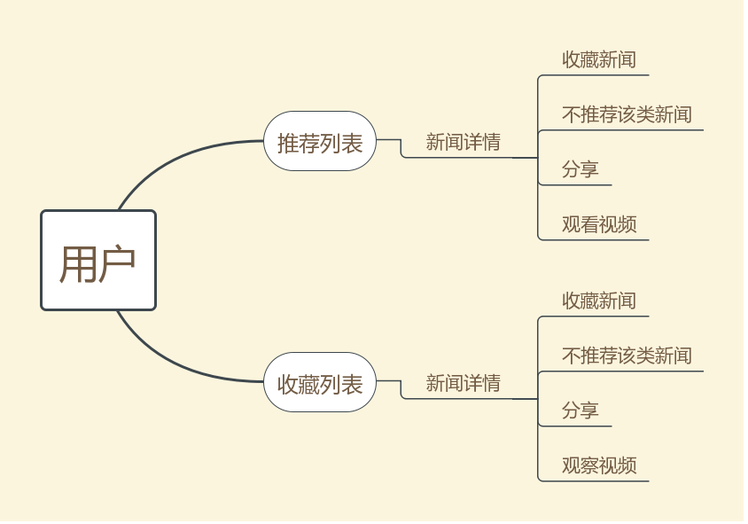
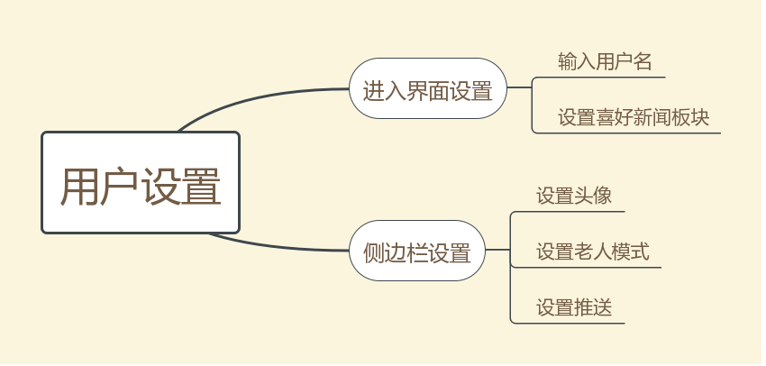

# 需求分析与设计文档

## 1、项目概述

### 1.1、产品描述

开发基于Android平台的应用程序，实现基础的新闻浏览功能，并根据用户喜好进行新闻推荐，同时提供在线观看新闻视频及新闻分享功能。此外提供老人模式与推送模式。

### 1.2、产品功能

新闻功能方面，根据用户的喜好进行新闻的推荐。

+ 点击新闻可以查看新闻的概况
+ 点击阅读更多进入新闻详情
  + 在线观看新闻视频
  + 收藏该新闻
  + 对该新闻不感兴趣，并根据关键词分析，后续不再推荐该类新闻
  + 分享新闻到微信客户端

用户个人中心

+ 第一次安装程序进行以下设置
  + 输入用户名
  + 设置自己喜好的新闻板块
+ 侧边栏的设置
  + 头像选择
  + 设置是否开启老人模式
  + 设置是否开启推送模式

###1.3、用户特点

本软件的最终用户为喜欢观察新闻的用户，熟悉移动端的操作。适用于喜爱视频的青少年，也适用于大字体的老年人，年龄跨度大。

## 2、具体需求

### 2.1、功能需求

+ 用户可以根据自己选择的新闻喜好查看推荐的新闻列表，而且可以不断刷新，得到新的新闻咨询
+ 用户可以在新闻列表中选择有兴趣的新闻，进行详细内容的阅读，同时可以观看该新闻的在线视频
+ 用户可以对新闻进行收藏，同时对本身的收藏列表可以进行管理。选择查看或者删除已添加的新闻。

### 2.2、外部接口需求

#### 2.2.1、硬件接口

无特殊要求

#### 2.2.2、软件接口

### 2.3、性能需求

本应用为移动端的新闻在线浏览，需要有较快的加载速度和页面渲染速度。阻塞操作不宜过度，时间较长的操作需要进行异步操作。

## 3、软件设计

### 3.1、设计模式

+ 单例模式：应用包括了多个界面，多个界面之间的数据是共享的。同时对于用户的使用记录也需要继续存储。因此使用单例模式，确实数据的同步更新。
+ 面向对象编程：应用中使用了面向对象编程的封装思量，按照业务逻辑将每一个界面进行了封装。
+ 发布订阅模式：为了防止响应时间过长，使用发布订阅模式，确保响应时间过长的计算或操作可以异步进行

### 3.2、架构设计

该程序含有个Activity，即HelloActivity用以显示欢迎页, FullScreenActivity用以进行程序介绍与设置用户名、喜欢新闻的类型, MainActivity用以显示推荐的5则新闻，对于每则新闻点击则有包含summary的悬浮窗，同时还兼顾导航栏，包含有用户信息、设置选项, DetailActivity用以显示新闻的详情页，包含有几个功能按键，分别执行视频跳转、收藏、不喜欢、分享的功能。而且含有UserDialog用以更改用户名, DislikeDialog以供用户选择不喜欢新闻的关键词, LoadingDialog用以加载状态显示。

- 用户进入应用则进入HelloActivity，在动画结束后判断用户是否第一次进入应用，是的话进入设置页，否则进入主页。
- 进入设置页，用户查看程序简介，并分别设置用户名、喜欢新闻的类型。在完成后也进入主页。
- 主页包含5则推荐新闻和侧边栏。新闻由获取由对应的类`MainActivityNetworkVisit`类进行网络访问、获取与分词筛选、缓存。在侧边栏可以更改用户名、头像、老人模式、是否打开推送、跳转收藏页。在主页中，点击新闻可以查看悬浮窗口中的summary，其中也包含标题、图片。同时可以左滑右滑进行切换。如果用户在悬浮窗口中点击阅读更多则进入详情页。
- 详情页包含顶部的图片。如果没有图片则进行默认图片的显示。如果新闻中检测到视频，则显示视频跳转按钮，否则不显示。视频跳转按钮点击后跳转到浏览器观看含有视频的原新闻。点击收藏按钮后可以收藏该新闻，数据库发生相应更改。如果已经收藏则提示不能重复收藏。对于不喜欢按钮，点击后弹出Dialog，用户可以选择不喜欢的关键词（根据内容筛选出现频数最高的4个关键词），该选择会反馈给分词表。这会影响（但不是决定）以后新闻获取不优先考虑含有该分词的新闻（为了避免用户只能看到含有相同分词的新闻，依然对部分新闻使用随机的筛选）。对于分享按钮，则点击复制url到剪贴板中并跳转微信。
- 对于收藏页，可以进行点击与删除操作。如果点击跳转详情页，如果长按则删除该项。对应数据库会发生更改。

###3.3、模块划分

根据以上的设计和分析，项目代码分成以下的模块：用户欢迎模块、推荐新闻列表模块、新闻详情模块、收藏列表模块、数据库处理模块、词频分析模块

代码的目录见code文件夹

